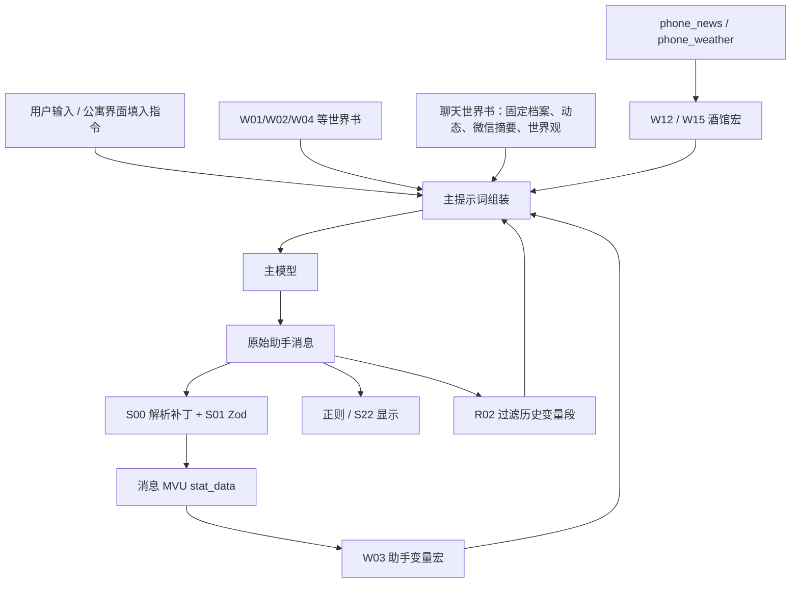
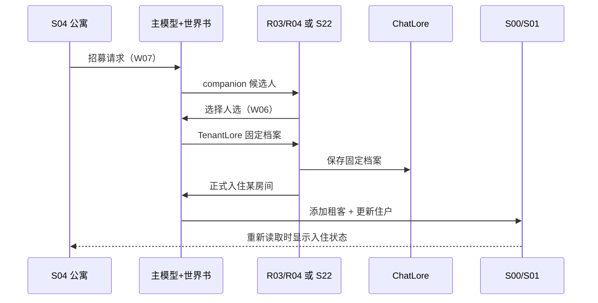

# 数据、生成与操作链路

## 数据分别存在哪里

| 数据 | 存放位置 | 主要写入者 | 主要读取者 | 导出原卡是否带走运行数据 |
| --- | --- | --- | --- | --- |
| 世界时间、公寓、租客即时状态 | 当前消息/回复分支的 MVU `stat_data` | S00/S01 解析模型补丁；S24 直接替换部分状态 | W03、S04、手机模块、S23–S29 | 这两份原卡只带初始化规则和开场补丁，不含游玩存档 |
| 租客固定档案 | 当前聊天绑定世界书，条目名为人名 | R04/S22 保存；S23 导入角色 | 主模型；S09/S26；S11/S27 | 不自动包含运行后建立的 ChatLore |
| 租客长期变化 | ChatLore `[租客动态]姓名` | S09 或 S26 调副模型后写入 | 主模型；档案 APP；手机聊天提示词 | 同上 |
| 手机正文记忆 | ChatLore `[租客微信]群聊记录` / `[租客微信]姓名` | S12 或 S27 | 主模型世界书扫描 | 同上，只保存截断摘要 |
| 原版手机完整消息 | IndexedDB `TenantChatDB`，conversations/messages | S07，由 S13/S11 操作 | S11/S12/S13 | 需单独手机导出 |
| 二改版通讯录完整消息 | IndexedDB `AptChatDB` | S27 | S27 | 需单独导出/迁移，没有自动读取 TenantChatDB |
| 新闻提示文本 | 酒馆聊天变量 `phone_news` | S06 或 S29，用 `/setvar` | W12 | 不属于角色卡的静态配置 |
| 天气提示文本 | 酒馆聊天变量 `phone_weather` | S19，用 `/setvar` | W15 | 同上 |
| 新闻/天气 UI 缓存 | localStorage：`phone_news_<chatId>_*`、`phone_weather_<chatId>_*`；二改为 `apt_news_<chatId>_*` | 对应新闻/天气模块 | 对应 APP | 另存于浏览器 |
| 手机副 API 配置 | localStorage：`tavernPhoneSettings_<角色名>` | S06 设置页 | 原版聊天、新闻、分析、欧欧聊天 | 原卡仅有空配置和默认值 |
| 二改版副 API 和 APP 配置 | localStorage `apt_os_settings` | S25 及其设置页 | S26–S29 | 不与原版设置自动同步 |
| 分析进度 | 原版 `tenant_analyzer_<chatId>_state`；二改版仅内存计数 | S09/S26 | 自动分析触发器 | 二改版跨聊天/重载行为与原版不同 |
| 创意角色、房间、世界观、表情包 | IndexedDB `WorkshopStickersDB` v2：contents/stickers | S23 导入/下载/编辑 | S23；S13 读取表情包 | 需工坊备份；云端上传是额外操作 |
| 工坊预设、活跃世界观 | localStorage `workshop_presets`、`workshop_active_worldview` | S23 | S23 应用面板 | 按浏览器存储，键未区分聊天 |
| 美化配置 | IndexedDB `BeautifyConfigDB` | S22 | S22 | 开关、深度等不在原卡运行存档中 |
| 欧欧聊天历史 | localStorage，`oc_chat_messages` 加聊天标识 | S21 | S21 | 不进手机 ChatDB，不自动回流正文 |
| 音乐、开关预设、主题 | localStorage `phone_music_v3`、`spm_presets`、`spm_active`、`apartment_theme` 等 | S17、S03、S04 | 对应界面，主题由 S22/S23 共用 | 浏览器内设置 |
| 大富翁棋子头像 | IndexedDB `monopoly_assets` | S24 | S24 | 另存；筹码等仍在 MVU |

因此，**备份角色卡、备份主聊天、备份 ChatLore、备份浏览器 APP 数据是不同工作**。当前上传的原卡不能视为一份完整运行存档。

## 主对话的闭环

R02 只影响送模型的历史文本，原始消息仍供 MVU、渲染器和部分旁路脚本读取。旁路脚本有自己的清洗方法，未必等同于主提示词历史。因此不能通过“主模型看不到 Analysis”推断副模型也看不到。

## 建造与正式招募

1. S04 根据缓存显示楼层、房间和住户。建造/装修/拆除/加层通常把文字追加到酒馆输入框，用户发送后才发生后续动作；它不直接修改房间字典。
2. 主模型参考 W04 的基建约束及 W01/W02，输出房间或楼层补丁，S00/S01 处理。重新打开公寓会读取最新 AI 消息变量。当前没有对所有 MVU 更新持续订阅，所以已打开界面的缓存并不保证即时刷新。
3. 招募按钮生成含 W07 关键词的消息。W07 要求五个候选人，R03/S22 显示并允许选一到两人。
4. 选择后发出含“作为新租客”的消息，触发 W06，主模型生成固定档案。此时仍不应完成入住。
5. R04/S22 的保存按钮把档案写入 ChatLore，条目名采用正文姓名。编辑名字会破坏以后按名字关联的数据。
6. 办理入住按钮读取 S04 缓存中的卧室，选空房或合租房后，发送“请让某人正式入住某房间”。模型更新租客字典和房间住户；这才是入住完成条件。

S23 工坊角色绕过五选一和档案生成：先直接保存固定档案，再把入住指令追加到输入框；工坊房间也只是填入装修指令。使用工坊预设导入角色，则可能只添加 ChatLore 资料，并未自动入住。必须按具体按钮区分这些动作。

## 手机聊天回流正文

S06 提供手机容器、APP 注册、事件和副 API 设置。S13 负责操作界面，S07 负责持久化，S11 负责生成，S12 负责同步。

发送时先写用户消息到 S07，再由 S11 组合固定档案、动态档案、MVU 人物状态、最近 5 条主对话、最近 30 条手机聊天及另一类聊天摘要。群聊额外读取各私聊最近 3 条；私聊额外读取群聊最近 5 条。副 API 返回后，S11 解析并保存一到多条回复，S13 通知 S12 同步。

S12 并不调用模型总结，而是截取文本：读取最近 30 条，群聊取末 10 条、私聊取末 8 条，每条最多 80 字，最终约 800 字。写入深度 4 的常驻世界书条目，后续主模型才获得手机记忆。同步标记不是“主模型读过”，也不是所有内容都被完整保留。

主对话中的手机相关叙事不会反向自动写入 S07；DLC 的 `<group_chat>` 也没有到 S07 的桥接。所谓“联动”主要是手机摘要到主模型的单向回流。

## 租客动态分析

S09 默认每跨过 30 个消息楼层、且最新索引为偶数时检查，不是严格“30 次 AI 回复”。它从近期消息中筛选出现过名字的租客，把“固定本色 + 上次动态 + 近期对话”交给副模型，经 S08 串行队列执行，结果写成 `[租客动态]姓名`。S14 可手动触发、查看并修改分析配置；S10 显示队列。

这条链路更新长期描述，**不会直接更新 MVU 中的状态、内心或关系字段**。主模型下一轮可以参考新动态再写补丁，两种记录因此有时间差。自动分析触发计数在执行成功之前前移，失败后不保证立即重试。

S26 二改版使用 AptSystem 队列，默认只提取 `<content>` 内的线索；主卡未要求正文包这个标签，可能筛不到任何有效内容。S27 的可选 chat/action 标签过滤也需要与实际正文格式配套。

## 新闻、天气与地图

- **新闻：**原版 S06 的新闻系统根据日期/状态/近期对话直接调用副 API，S20 只是读它的界面；它没有走 S08 的新闻任务类型。生成结果写 `phone_news`，W12 注入主提示词。
- **天气：**S19 按日期、季节和时段生成预报，写 `phone_weather`，W15 注入。它尝试 `getvar('世界')`，失败后从单条最近补丁提取日期时间，未采用公寓的 MVU 读取方法，也未跨消息重建世界日期。
- **城市地图：**S16 的静态地点按钮填“我前往了…”，覆盖输入框；不触发 W13。
- **世界地图：**S18 用 Leaflet、地图瓦片和 Nominatim 查询目的地，读取 MVU 租客供选择同行者，填入含坐标的旅行消息，触发 W13。地点未保存为统一世界位置，天气也不会因此改成目的地实况。
- **二改报社：**S29 走 AptSystem 队列，仍写 `phone_news`。二改音乐 S28 读 `世界.天气` 选择环境音，但 S19 写的是另一处变量，且二创预设会关闭 S19。

## 世界观应用与生命周期

S23 的 `wsApplyWorldView` 分两部分：把世界观写为 `[创意世界]名称` 等 ChatLore 条目；有 greeting 时替换当前聊天第 0 条消息，删除其旧 variables，再发一个虚构 chat_id_changed 事件，500ms 后发回真实 ID，希望 MVU 重建状态。它不新建聊天、不清理后续对话和所有分支，也不备份旧第 0 条消息。

附加世界书条目允许任意名称，而替换/清除时只清理 `[创意世界]` 前缀，因此非此前缀的附加规则可能残留。`wsAutoInjectWorldView` 虽有函数定义，导出中没有调用点；不能依据其注释认定新聊天自动注入已经接通。

角色脚本之间通过父窗口共享对象和事件；不能把导出数组顺序当作初始化完成顺序。当前助手运行列表按 ID 排序，并各自装载模块 iframe。S06/S09/S10 等使用定时延迟或一次性探测；主程序、副模块、MVU 就绪存在时序依赖。依据：[脚本运行列表](https://github.com/N0VI028/JS-Slash-Runner/blob/8e0f4324e7d051025a333831411f03bd3145fac8/src/store/iframe_runtimes/script.ts)、[iframe 生成](https://github.com/N0VI028/JS-Slash-Runner/blob/8e0f4324e7d051025a333831411f03bd3145fac8/src/panel/script/iframe.ts)。实际安装版本仍需对照。

## 大富翁

作者已取消此方向。以下保留为 Z5.20 原始导出的历史说明，不属于后续开发范围。

S24 当前关闭。启用后棋盘/分岔/骰子/小游戏/筹码/道具/据点/分基地由脚本直接结算到当前消息的 MVU；场景叙事则由临时 ChatLore `[场景设定]` 和可选 `[场景氛围指导]` 引导主模型。填入的场景消息通常需要用户发送，AI 回复后清理临时条目。

普通场景提示词要求“不输出变量更新”，与 W01/W02 的常驻更新要求会同场出现，需要明确场景模式的优先级。招募 NPC 是例外：主基地仍走 TenantLore 保存与房间选择；分基地要求 AI 只加租客，脚本在回复事件中从显示文本提取 TenantLore name 再写分基地住户。渲染后标签可能已消失，这个交接点尤其脆弱。

## 切换不是迁移

| 模式 | 启用脚本 | 与这份导出相比 |
| --- | --- | --- |
| 当前导出 | S00–S04、S06–S23 | 23 个；S22 美化开，S24 大富翁关 |
| switcher“原版” | S00–S04、S06–S21、S23–S24 | 仍是 23 个，但关闭 S22、开启 S24 |
| switcher“二创版” | S00–S03、S23–S29 | 11 个；保留工坊、大富翁，切换到 AptSystem |

两种内置模式的 regexRules 均为空，执行逻辑不会重设九条正则；世界书也没有随着内置模式切换。它们不是“当前状态复原”或“成套数据迁移”。恢复前必须保存实际开关快照和对应应用数据。
