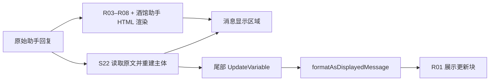

# 9 条正则与两套渲染器

九条正则全部启用，`runOnEdit=false`，未设 minDepth/maxDepth，substituteRegex=0。R02 应用于用户和助手文本，其余只应用于助手文本。源码与原始字段可由 [提取工具](../../tools/inspect_card.py) 查看。

| 编号 / 原名 | 生效方向 | 匹配与输出 | 上下游 |
| --- | --- | --- | --- |
| R00 对AI隐藏状态栏（必开） | 显示与提示词 | 删除 `<StatusPlaceHolderImpl/>`，裸正则无 g，一次只删一个。 | 同时勾选 markdownOnly 和 promptOnly，**两个分支均可生效**；不是互斥导致不执行。 |
| R01 完整变量更新（必开） | 显示 | 大小写不敏感、全局、跨行匹配 update 或 updatevariable 标签；将内容放入 Landlord Update Variable 折叠展示。 | W02 输出；S00 另行解析原文。替换内容虽长，但没有执行变量的 JavaScript。S22 尾部渲染仍可能调用这条规则。 |
| R02 隐藏变量更新 | 提示词 | 删除完整或尚未闭合的 update/updatevariable 段。g/i/s。 | 避免把历史 Analysis/JSONPatch 再送回主模型；S11/S27 若能调用主页面 getRegexedString，也会采用此过滤。不会清除原消息存档。 |
| R03 招募租客状态栏 | 显示 | 把 `<companion>` 转为带脚本的 HTML 代码块。按“候选人:”分块、严格字段格式解析，最多勾选 2 位。无 g。 | W07 → R03 → `/send 我选择 "姓名" 作为新租客… /trigger` → W06。按钮写“确认入住”，实际此步只是请求生成档案。 |
| R04 租客档案状态栏 | 显示 | 全局匹配 `<TenantLore name="…">`，生成可编辑档案，提供保存和房间选择。 | W06 / S24 输出；保存按钮直接 upsert 聊天世界书；入住按钮发主对话命令，等待 MVU 更新。还依赖 S04 的 getApartmentBedrooms。 |
| R05 DLC1群聊记录 | 显示 | 匹配 `<group_chat>` 的标题与余下正文；HTML 内脚本按英文冒号拆分发言。无 g。 | W08 的附加群聊；与 S07/S11 的手机群聊无数据库联系。 |
| R06 DLC2浏览器搜索记录 | 显示 | 全局匹配 `<search_history>` 标题与正文，HTML/pre 展示，无脚本。 | W09 → R06 或 S22。 |
| R07 DLC3私人日记 | 显示 | 匹配 `<diary_entry>` 首行与正文，HTML/pre 展示，无脚本、无 g。 | W10 → R07 或 S22。 |
| R08 DLC4虚拟直播间 | 显示 | 匹配 `<live_stream>` 中 `[直播画面]` 行与评论，允许该行中英文冒号，HTML/pre 展示，无脚本、无 g。 | W11 → R08 或 S22。 |

## 匹配字段是接口

R03 的字段提取实际依赖 `名字: "值"` 这种形式：英文冒号、冒号后的空格和英文双引号均有意义。离线样例已确认：`名字："值"` 和 `名字:"值"` 不匹配。其余字段同样依赖键名及格式。候选人的值包含双引号，也会提前截断。

R04 匹配标签里的 name，但实际存档名称从正文“姓名：…”解析，用户可编辑正文。这解释了原卡使用说明为什么要求不要修改名字：候选人名字、正文姓名、ChatLore 条目名、MVU 租客字典键、房间住户字符串必须指向同一人。当前未提供稳定的人物 ID 或改名事务。

保存与入住按钮独立。没有“保存成功后才允许入住”的程序门槛，住户也不会因保存按钮而自动写入变量。R04 的兼容路径会沿父窗口寻找世界书 API，卧室列表却仅从直接父窗口获取；嵌套渲染层级改变时，两种能力不一定同时可用。

## 当前 S22 的接管方式

“美化完整修复版”当前启用。它读取原始消息而不是已经生成的 R03–R08 界面，识别相同的 companion、TenantLore 和 DLC 标签，重新制作 HTML，替换 `.mes_text` 并绑定自己的按钮。因此默认导出存在两套同协议渲染实现：

S22 使用助手事件，在收信、重渲染、编辑、切换回复、切换聊天后延迟重建最近 10 条 AI 消息；正文主题、thinking 结束标记和 renderDepth 存在独立 IndexedDB 配置。候选人/档案的主要业务动作与正则版本重复，但标签匹配更宽松；DLC 发言的中英文冒号兼容也不同。显示哪个版本取决于消息深度、是否启用 S22、助手渲染设置以及事件先后。

不能同时修改两套实现中的一套，就假定全部入口已经修复。尤其重复重建会丢弃旧 DOM 内的勾选、按钮禁用等临时状态；相关实测见 [验收方案](verification.md)。

## 已复现的边界

- R02 输入“前 + 更新块一 + 中间正文 + 更新块二 + 后”，结果为“前后”，中间正文也被删。不是原始存档删除，而是后续模型看不到这部分历史。
- R00 两个占位符只删第一个；R03、R05、R07、R08 同样没有 g。单段协议可工作，多个同类段需另外验证。
- “正则均可编译”“三个内嵌脚本均可解析”仅证明语法正确，不证明 HTML iframe、跨窗口 API 或按钮实际可用。

SillyTavern 的显示/提示词判断采用 OR 条件，正则按数组顺序处理；字符串正则并不会自动补 g。依据：[执行方向](https://github.com/SillyTavern/SillyTavern/blob/8172dcd0ee672d3cd9a5e5f7af134f91a45cd2b8/public/scripts/extensions/regex/engine.js#L334)、[正则字符串解析](https://github.com/SillyTavern/SillyTavern/blob/8172dcd0ee672d3cd9a5e5f7af134f91a45cd2b8/public/scripts/utils.js)。
