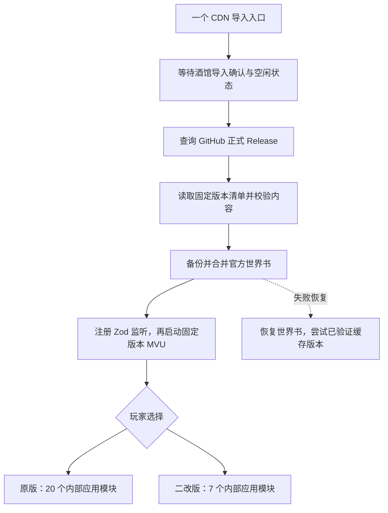

# 运行与更新说明

玩家只导入一个酒馆助手脚本。代码内部仍按职责拆分，方便维护；原版和二改版各自装载，避免两套同名全局对象一起工作。

## 更新什么

- **脚本**：完整运行包更新，含内部模块、界面逻辑和后续修复。玩家无须逐个替换模块。
- **官方世界书**：更新当前角色绑定的主世界书中能识别为官方的条目。采用“原官方内容 / 玩家现有内容 / 新官方内容”三方比较。玩家修改过的字段、条目开关、新增条目、未知字段和本地删除尽量保留；有冲突时保留玩家版本并提示。
- **首次导入遗漏的世界书**：绑定名称存在、实际书不存在时，从随入口保存的基线创建，然后应用更新；不会用完整新书覆盖已有书。
- **正则、开场和人物介绍**：随新版完整卡导出，当前不远程自动替换。自动替换正则会触发酒馆聊天重载，因此未把它加入热更新链路。世界书更新也不会重置现有 MVU 存档变量。
- **玩家手机记录、ChatLore、工坊与 API 设置**：不进入远程更新内容包。原版与二改版各用原来的数据库；不自动迁移或合并两套历史。

主世界书若被多个角色共用，更新作用于同一本书。没有主世界书绑定时保留玩家设置并提示，不擅自换绑另一份世界书。

## 什么时候更新

每次酒馆助手重新启动本入口时检查；单次游戏会话内固定使用当前代码。发布开发提交不会更新玩家。只有 GitHub 非草稿、非预发布且标签为 `v数字.数字.数字` 的 Release 被自动发现。

运行文件使用带版本标签的 jsDelivr URL，代码与世界书必须匹配同一清单的版本、字节数和 SHA-256。发布后不要移动标签或覆盖同名版本；修订使用新版本号。

当前入口本身固定在一个版本，但它能下载未来正式版的运行包。如果未来要改变入口协议，仍需导入新的入口；这是单入口方案的明确维护边界。

## 失败与恢复

检查更新失败时尝试已验证版本；新运行包启动失败时恢复本次世界书修改，再尝试此前成功的缓存版本。世界书更新在 IndexedDB 中保存备份及未完成事务记录，意外刷新后先恢复未完成变更。

玩家在更新后做的新修改，不会被失败恢复整本覆盖。工坊更换开场也先保存原消息和 MVU 数据，完成消息与变量写入后才清除事务记录；切换聊天中断时，在回到该聊天后恢复未完成操作。

缓存存于当前浏览器的 IndexedDB，换设备、无痕窗口或清除浏览器数据后不会共享。初次载入 CDN 入口及上游依赖仍需要网络，不能把缓存回退理解为完整离线运行。

## 固定的上游

- SillyTavern 验证版本：1.18.0，`8172dcd0ee672d3cd9a5e5f7af134f91a45cd2b8`。
- 酒馆助手验证版本：4.9.5，`8e0f4324e7d051025a333831411f03bd3145fac8`。
- MVU beta：`61010dab47bc3a08a1b626320bf7fc8c9573eca4` 的构建包。
- MVU Zod 工具：tavern_resource `dee97e8c3e24e1e75efe21141743e4b5c0af776e`。

固定了 MVU 和 Zod 工具的仓库提交；上游构建包内部的部分 npm CDN 依赖仍由上游指定。引用来源见 [参考资料](references.md)。
