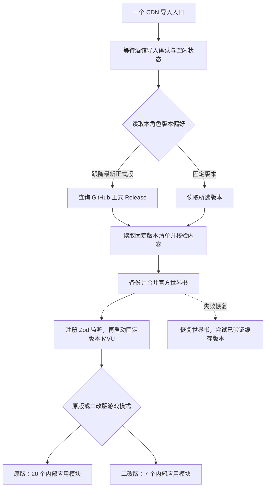

# 运行与更新说明

玩家只导入一个酒馆助手脚本。入口管理左下角“版本与更新”，运行包管理右下角原版/二改版游戏模式。两种选择相互独立；代码内部仍按职责拆分，原版和二改版各自装载。

## 更新什么

- **脚本**：完整运行包更新，含内部模块、界面逻辑和后续修复。玩家无须逐个替换模块。
- **官方世界书**：更新当前角色绑定的主世界书中能识别为官方的条目。采用“原官方内容 / 玩家现有内容 / 新官方内容”三方比较。玩家修改过的字段、条目开关、新增条目、未知字段和本地删除尽量保留；有冲突时保留玩家版本并提示。
- **首次导入遗漏的世界书**：绑定名称存在、实际书不存在时，从随入口保存的基线创建，然后应用更新；不会用完整新书覆盖已有书。
- **正则、开场和人物介绍**：随新版完整卡导出，当前不远程自动替换。自动更新仅处理脚本与官方世界书，也不会重置现有 MVU 存档变量。
- **玩家手机记录、ChatLore、工坊与 API 设置**：不进入远程更新内容包。原版与二改版各用原来的数据库；不自动迁移或合并两套历史。

主世界书若被多个角色共用，更新作用于同一本书。没有主世界书绑定时保留玩家设置并提示，不擅自换绑另一份世界书。

## 什么时候更新

默认选择“跟随最新正式版”，每次酒馆助手重新启动本入口时检查；单次游戏会话内固定使用当前代码。只有 GitHub 非草稿、非预发布且标签为 `v数字.数字.数字` 的 Release 被自动发现。开发分支提交及候选版不进入自动更新。

玩家也可在左下角“版本与更新”固定版本。列表首次展开时刷新公开 Release 目录，此后可手动刷新；默认折叠时不请求目录。列表包含公开正式版、公开候选版，并补充入口默认版、当前运行版、本角色上次可用版及已固定版本。GitHub 草稿不进入公开目录。

点击“保存选择并刷新”会先读取并校验所选包，再保存偏好，通过酒馆助手重新加载唯一脚本后生效，当前角色和聊天保持打开。生成消息、聊天切换或角色归属变化会阻止不安全的应用操作；玩家应先保存编辑。选择固定版后，后续启动仍使用该版本。恢复“跟随最新正式版”才会重新跟随自动更新。

偏好按角色的头像标识保存在当前浏览器 IndexedDB 中，同一个角色的不同聊天共用选择；跨设备和浏览器不共享。已验证的分发包可缓存复用，但“上次可用版本”按角色分别记录，避免一个角色的版本选择影响另一个角色的恢复结果。

运行文件使用带版本标签的 jsDelivr URL，代码与世界书必须匹配同一清单的版本、字节数和 SHA-256。发布后不要移动标签或覆盖同名版本；修订使用新版本号。

正常跟随正式版时，不会因为目录返回较低版本而自动降级已成功使用的较高正式版。玩家明确从固定版本改回“跟随最新正式版”，则允许采用实际最新正式版，即使其版本低于此前固定的版本。

`rc.1` / `rc.2` 玩家需要这一次导入 `rc.3` 完整卡或本版单入口，取得版本面板。之后，保持清单 `format: 1` 兼容的普通脚本及官方世界书更新无须重新导入卡。当前入口本身固定在一个版本，能读取未来兼容的运行包；如果未来改变入口协议，仍可能需要导入新版入口。版本面板由入口管理，因此选择较旧运行包后仍能打开面板切回。

## 失败与恢复

检查更新失败时尝试已验证版本；新运行包启动失败时恢复本次世界书修改，再尝试本角色此前成功的缓存版本。固定版本失败后，原来的固定偏好仍保留，下次启动继续尝试；面板同时显示实际运行版本及失败原因，玩家可重新选择。首次运行没有可用缓存时尝试入口默认版。

世界书更新在 IndexedDB 中保存备份及未完成事务记录，意外刷新后先恢复未完成变更。主动切回旧版本会对该版本官方世界书执行同样的三方合并，保留玩家修改及冲突。**版本切换只改变运行脚本和可合并的官方世界书，不会把聊天记录或 MVU 存档恢复到过去。** 较旧脚本对较新存档的兼容性仍需相应版本验证。

玩家在更新后做的新修改，不会被失败恢复整本覆盖。工坊更换开场也先保存原消息和 MVU 数据，完成消息与变量写入后才清除事务记录；切换聊天中断时，在回到该聊天后恢复未完成操作。

缓存存于当前浏览器的 IndexedDB，换设备、无痕窗口或清除浏览器数据后不会共享。初次载入 CDN 入口及上游依赖仍需要网络，不能把缓存回退理解为完整离线运行。

面向玩家的具体操作见 [版本选择说明](version-selection.md)，本轮检查与分发状态见 [测试记录](testing/README.md)。

## 固定的上游

- SillyTavern 验证版本：1.18.0，`8172dcd0ee672d3cd9a5e5f7af134f91a45cd2b8`。
- 酒馆助手验证版本：4.9.5，`8e0f4324e7d051025a333831411f03bd3145fac8`。
- MVU beta：`61010dab47bc3a08a1b626320bf7fc8c9573eca4` 的构建包。
- MVU Zod 工具：tavern_resource `dee97e8c3e24e1e75efe21141743e4b5c0af776e`。

固定了 MVU 和 Zod 工具的仓库提交；上游构建包内部的部分 npm CDN 依赖仍由上游指定。引用来源见 [参考资料](references.md)。

重载使用酒馆助手的 [`reloadIframe()`](https://github.com/N0VI028/JS-Slash-Runner/blob/8e0f4324e7d051025a333831411f03bd3145fac8/%40types/iframe/util.d.ts) 接口，先等待当前内部模块清理完成，再重建唯一入口的执行环境。已验证配置不会导航酒馆主页面或改变所选聊天；接口缺失时才兼容回退为整页刷新。
